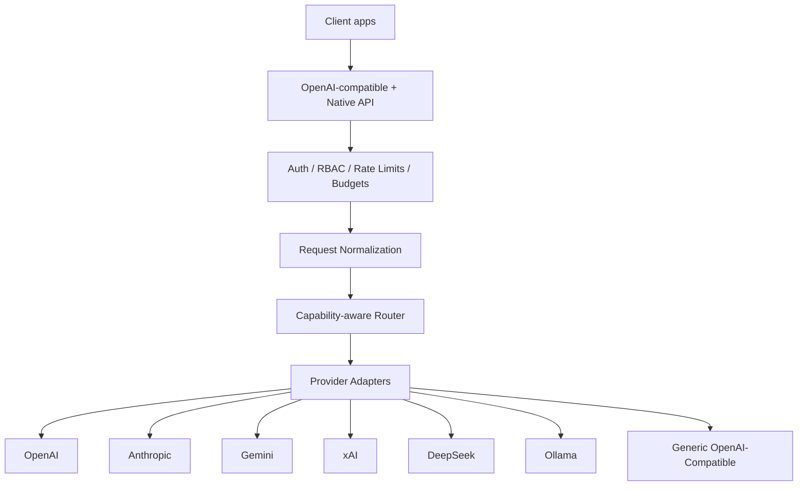

# Self-Hosted AI Gateway

A self-hosted, OpenAI-compatible gateway for OpenAI, Anthropic, Gemini, xAI, DeepSeek, Ollama, and generic OpenAI-compatible services.

## Quick start

```bash
cp .env.example .env
# Set POSTGRES_PASSWORD, SESSION_SECRET, BOOTSTRAP_ADMIN_PASSWORD, and MASTER_ENCRYPTION_KEY
docker compose up -d --build
```

Generate a master key with Node:

```bash
node -e "console.log(require('crypto').randomBytes(32).toString('base64'))"
```

Open:

- Admin UI: http://localhost:8080/admin/
- OpenAPI docs: http://localhost:8080/docs
- Health: http://localhost:8080/health

## OpenAI-compatible API

- `GET /v1/models`
- `POST /v1/chat/completions`
- `POST /v1/embeddings`

Use a gateway API key created in the admin UI/API. Existing clients primarily need a new base URL and gateway API key.

## Architecture



## Security

- Gateway API keys are stored as SHA-256 hashes and shown only at creation.
- Provider credentials stored in PostgreSQL are encrypted with AES-256-GCM using `MASTER_ENCRYPTION_KEY`.
- Prompt/response content is not written to operational tables by default.
- Admin mutations require an authenticated admin session and CSRF token.
- Secrets are redacted from standard logs/errors.

## Routing and fallbacks

The gateway supports explicit provider/model selection and deterministic automatic routing. Automatic selection filters by required capabilities, provider/model access restrictions, health, and configured priority. Retry/fallback is conservative: tool requests and partially streamed responses are not blindly replayed.

Routing modes can be selected as the Admin default or per request with the
`X-Gateway-Routing-Mode` header (or `routing_mode` request field):

- `NORMAL` preserves policy/priority routing.
- `FREE_ONLY` permits only models explicitly classified `free` or `local` and never falls through to `paid` or `unknown`.
- `LOCAL_ONLY` permits only `local` models.
- `CHEAPEST` prefers the lowest known compatible price; unknown pricing never outranks known-free models.

Cost classification is an administrative billing assertion, not an inference
from consumer subscriptions. Classify a model as `free` only after confirming
that the configured provider API account is eligible for a free API tier.

## Model verification and multimodal input

Provider discovery records advertised models; Admin **Verify** performs a
minimal capability-appropriate live invocation and stores its sanitized status.
Automatic routing excludes models known unavailable, while a temporary rate
limit does not permanently disable them.

Chat messages accept OpenAI `image_url` content blocks. Gemini supports base64,
data URLs, and Gemini Files URIs; arbitrary remote URLs are rejected rather than
silently discarded. Image requests are routed only to models whose stored
capabilities explicitly include `imageInput`.

## Budgets and usage

Usage records track input/output/cached/reasoning tokens, model/provider, estimated cost, API key/user, request ID, and timestamps. Budget checks reserve estimated spend/tokens before upstream invocation and reconcile afterward.

## Adding a provider

Implement the `ProviderAdapter` interface in `apps/gateway/src/core/provider.ts`, register it in `apps/gateway/src/adapters/index.ts`, translate normalized requests/responses/stream events, normalize provider errors, and add contract tests using a local mock HTTP server.

## Backup / recovery

Back up PostgreSQL with `pg_dump`. Keep the `MASTER_ENCRYPTION_KEY` separately and securely. Encrypted provider credentials cannot be recovered without the same key.

## Upgrade

Keep the database volume, update source/images, run migrations, then restart the stack. Migrations are additive and executed at container startup.

## Development verification

On Windows PowerShell:

```powershell
Set-Location "$HOME\Downloads\self-hosted-ai-gateway"
.\scripts\windows-verify.ps1
```

Live provider verification requires legitimate provider credentials. Mock/contract tests do not imply live verification.
